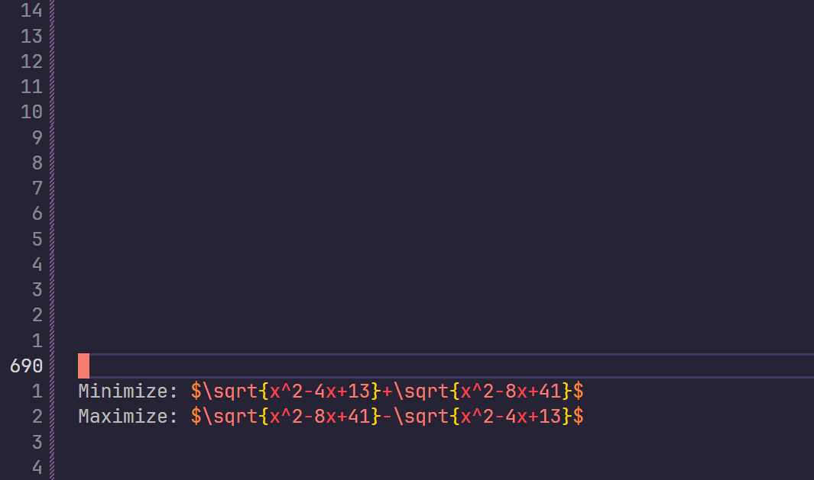
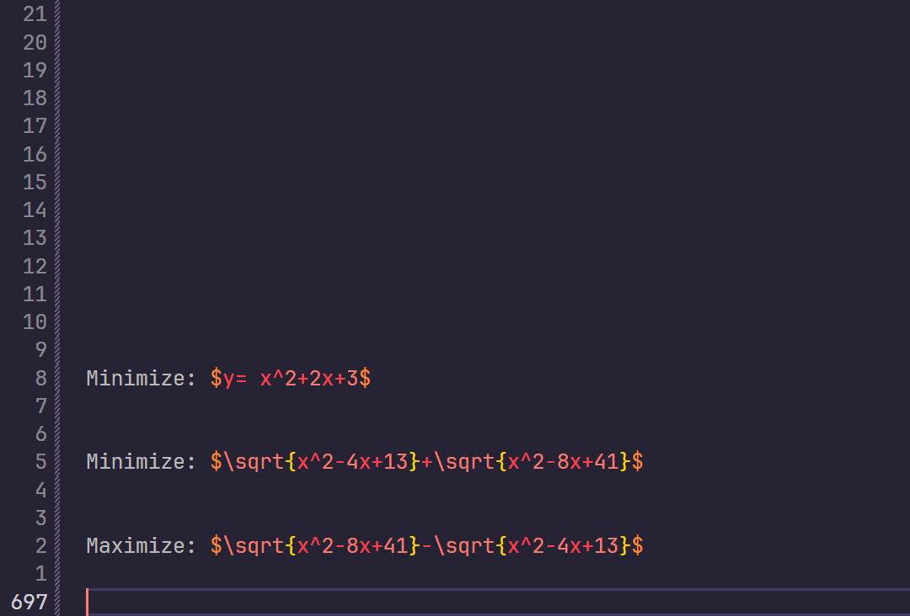

# vscode-latex-pair-editor

LaTeX-Pair-Editor will enhance your editing when writing LaTeX pair environments, such as `\begin` and `\end`.

LaTeX-Pair-Editor also provide better env wrapper commands.

## Features

### ✨ Synchronized Environment Name Editing

Simply place your cursor inside an environment name, and a second cursor will automatically appear in the corresponding tag, allowing you to edit both simultaneously.


### 🚀 Support Vim Multi-Cursor Edit Mode

In fact, we just created a new cursor, so multi-cursor is supported.


### ⚙️ Itemize And Enumerate Wrapper

Use the cursor to select a portion of text, right-click to use the corresponding command to wrap, supporting itemize and enumerate.



> [!TIP]
> If the multiline text contains empty lines, this command will delete the empty lines.



## Usage Instructions

- **How to use:**
    - Click inside the environment name, for example, the word `itemize` in `\begin{itemize}`. **(Works with any environment in `\begin{...}` and `\end{...}`)**.
    - Move the cursor inside the environment can also take effect.
    - After selecting the text, right-click to use the wrap command.

## Installing

1. VSCode Version > 1.75.0 (For future development)

Options:

1. Via VSCode Plugin Market
2. Via `.vsix` (See Release)
    1. In VSCode, go to `Extensions View`
    2. Select `Views and More Actions...`
    3. Select `Install from VSIX...`
3. From cli:

```bash
# if you use VS Code
code --install-extension latex-pair-editor-0.0.2.vsix

# if you use VS Code Insiders
code-insiders --install-extension latex-pair-editor-0.0.2.vsix
```

## Extension Settings

LaTeX-Pair-Editor will be configurable in the future.

## Release Notes

### Version 0.0.1

First Version, Initial Commit, Using RegExp to recognize environments.

### Version 0.0.2

Rewrite docs, Github Synchronous

### Version 1.0.0

Support Itemize And Enumerate Warpper, and Unwrapping.

---
